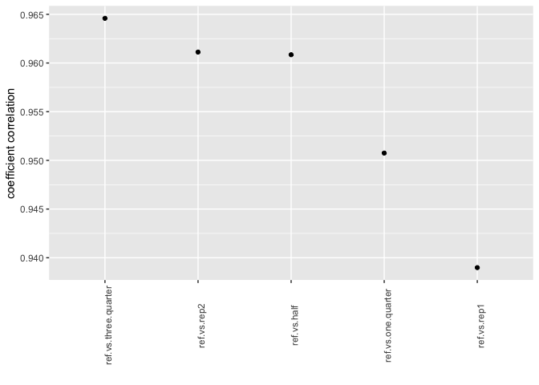

# coverage_rep_RNAseq_test
Ruijuan Li  
4/15/2017  


```r
# goal: 
# determine the most cost effecient coverage (1 VS 3/4 VS 1/2 VS 1/4) & rep (3 VS 2 VS 1) # for illumina RNAseq by checking the correlation of glmfit fitted values for reduced dataset with the full dataset (3 reps & full coverage)

# Trimmomatic trimming --> STAR mapping --> ReadsPerGene.out.tab    
```

# function 

```r
library(edgeR)
```

```
## Loading required package: limma
```

```r
library(ggplot2)
```

```
## Warning: package 'ggplot2' was built under R version 3.2.5
```

```r
##### with reps 
get.fitted.value <- function(reads.formated){

  # check test data type 
  gene_num_dim <- dim(reads.formated) 
  cat(cat(gene_num_dim[1]) , cat(" genes ") , cat("exsited in this dataset with "), cat(gene_num_dim[2]/2), cat(" reps")) 
  cat("\n") 
  
  # set up sample description 
  reads.formated.sample <-data.frame(file=colnames(reads.formated),
                               genotype=factor(gsub("([[:print:]]+)(_)([[:print:]]+)(_)(1|2|3)","\\1",colnames(reads.formated))),	
                               stage=factor(gsub("([[:print:]]+)(_)([[:print:]]+)(_)(1|2|3)","\\3",colnames(reads.formated))),	
                               group=factor(gsub("([[:print:]]+)(_)([[:print:]]+)(_)(1|2|3)","\\1\\3",colnames(reads.formated)))
  )
  
  # filter based on read count 
  cat("number of expressed genes if filtered based greater than 10 reads in at least 3 libs:")
  reads.formated.small <- reads.formated[rowSums(reads.formated > 10) >= 3,]
  cat(dim(reads.formated.small)[1])
  cat("\n")
  
  # normalize 
  dge.reads.formated <- DGEList(counts=reads.formated, group=reads.formated.sample$group)
  dge.reads.formated <- calcNormFactors(dge.reads.formated, method = "TMM") 
  
  # pairwise comparison using GLM model 
  # design matrix # w/o batch effect
  design.reads.formated <- model.matrix(~0+group, data = reads.formated.sample)
  dge.reads.formated <- estimateGLMCommonDisp(dge.reads.formated, design.reads.formated,verbose = F) # Disp = 0.13675 , BCV = 0.3698
  dge.reads.formated <- estimateGLMTrendedDisp(dge.reads.formated,design.reads.formated)
  dge.reads.formated <- estimateGLMTagwiseDisp(dge.reads.formated,design.reads.formated)
  
  ## fit model & look for DEGs
  fit.reads.formated <- glmFit(dge.reads.formated, design.reads.formated)
  
  # colnames(fit.flowering.halfhalf$coefficients)
  lrt.reads.formated <- glmLRT(fit.reads.formated, contrast = c(1, -1))
  number.reads.formated <- summary(de.reads.formated <- decideTestsDGE(lrt.reads.formated, p=0.05))
  DEgene.reads.formated <- topTags(lrt.reads.formated,n = Inf)$table[topTags(lrt.reads.formated,n = Inf)$table$FDR<0.05,]
  
  cat("number of differentially expressed genes between genotypes:")
  cat(dim(DEgene.reads.formated)[1])
  cat("\n")
  
  return(fit.reads.formated)
} 

##### w/o rep 
get.fitted.value.no.rep <- function(reads.formated){

  # check test data type 
  gene_num_dim <- dim(reads.formated) 
  cat(cat(gene_num_dim[1]) , cat(" genes ") , cat("exsited in this dataset with "), cat(gene_num_dim[2]/2), cat(" reps")) 
  cat("\n") 
  
  # set up sample description 
  reads.formated.sample <-data.frame(file=colnames(reads.formated),
                               genotype=factor(gsub("([[:print:]]+)(_)([[:print:]]+)(_)(1|2|3)","\\1",colnames(reads.formated))),	
                               stage=factor(gsub("([[:print:]]+)(_)([[:print:]]+)(_)(1|2|3)","\\3",colnames(reads.formated))),	
                               group=factor(gsub("([[:print:]]+)(_)([[:print:]]+)(_)(1|2|3)","\\1\\3",colnames(reads.formated)))
  )
  
  # filter based on read count 
  cat("number of expressed genes if filtered based greater than 10 reads in 2 libs:")
  reads.formated.small <- reads.formated[rowSums(reads.formated > 10) >= 2,]
  cat(dim(reads.formated.small)[1])
  cat("\n")
  
  # normalize 
  dge.reads.formated <- DGEList(counts=reads.formated, group=reads.formated.sample$group)
  dge.reads.formated <- calcNormFactors(dge.reads.formated, method = "TMM") 
  
  # pairwise comparison using GLM model 
  # design matrix # w/o batch effect
  design.reads.formated <- model.matrix(~0+group, data = reads.formated.sample)
  # pick a reasonable dispersion value for data w/o rep to account for biological varaibility ... 
  bcv <- 0.4 # pick 0.4 because this is close to the value I get from 3 reps 
  dge.reads.formated <- estimateGLMCommonDisp(dge.reads.formated, design.reads.formated,verbose = F) # Disp = 0.13675 , BCV = 0.3698
  cat("set common dispersion to 0.4\n")  
  dge.reads.formated$common.dispersion <- bcv ^ 2
  # dge.reads.formated <- estimateGLMTrendedDisp(dge.reads.formated,design.reads.formated)
  # dge.reads.formated <- estimateGLMTagwiseDisp(dge.reads.formated,design.reads.formated)

  ## fit model & look for DEGs
  fit.reads.formated <- glmFit(dge.reads.formated, design.reads.formated)
  
  # colnames(fit.flowering.halfhalf$coefficients)
  lrt.reads.formated <- glmLRT(fit.reads.formated, contrast = c(1, -1))
  number.reads.formated <- summary(de.reads.formated <- decideTestsDGE(lrt.reads.formated, p=0.05))
  DEgene.reads.formated <- topTags(lrt.reads.formated,n = Inf)$table[topTags(lrt.reads.formated,n = Inf)$table$FDR<0.05,]
  
  cat("number of differentially expressed genes between genotypes:")
  cat(dim(DEgene.reads.formated)[1])
  cat("\n")
  
  return(fit.reads.formated) 
}  
```

## coverage test (all VS 3/4 VS 1/2 VS 1/4)

```r
######### all trimmed data 
flowering.read.count.all <- read.table("/Users/ruijuanli/Desktop/Brassica_project/KIAT_RNA_seq/read_count/read.count.flowering.all.tsv", header = T, check.names = F)
rownames(flowering.read.count.all) <- flowering.read.count.all[,1]
flowering.read.count.all <- flowering.read.count.all[,-1]

# format data 
head(flowering.read.count.all)
```

```
##                 2   6 Ae_Gae_2 Ae_Gae_3 All1_Gae_2 All1_Gae_3
## BnaC09g12820D  25  43       14       18          0          8
## BnaC09g12810D 341 295      544      398        374        519
## BnaC09g12800D 102  74       66       51         75         71
## BnaC09g12790D   0   0        0        0          0          0
## BnaC09g12780D 129  99       59       69         63         78
## BnaC09g12770D 112 109       65       50         65         69
```

```r
dim(flowering.read.count.all) # 101040     6 
```

```
## [1] 101040      6
```

```r
colnames(flowering.read.count.all)
```

```
## [1] "2"          "6"          "Ae_Gae_2"   "Ae_Gae_3"   "All1_Gae_2"
## [6] "All1_Gae_3"
```

```r
# replace sample ID 
colnames(flowering.read.count.all) <- c("Da-Ol-1_flowering_3","Da-Ae_flowering_3","Da-Ae_flowering_1","Da-Ae_flowering_2","Da-Ol-1_flowering_1","Da-Ol-1_flowering_2")
head(flowering.read.count.all)
```

```
##               Da-Ol-1_flowering_3 Da-Ae_flowering_3 Da-Ae_flowering_1
## BnaC09g12820D                  25                43                14
## BnaC09g12810D                 341               295               544
## BnaC09g12800D                 102                74                66
## BnaC09g12790D                   0                 0                 0
## BnaC09g12780D                 129                99                59
## BnaC09g12770D                 112               109                65
##               Da-Ae_flowering_2 Da-Ol-1_flowering_1 Da-Ol-1_flowering_2
## BnaC09g12820D                18                   0                   8
## BnaC09g12810D               398                 374                 519
## BnaC09g12800D                51                  75                  71
## BnaC09g12790D                 0                   0                   0
## BnaC09g12780D                69                  63                  78
## BnaC09g12770D                50                  65                  69
```

```r
fitted.all.3 <- get.fitted.value(flowering.read.count.all)
```

```
## 101040 genes exsited in this dataset with 3 reps
## number of expressed genes if filtered based greater than 10 reads in at least 3 libs:48968
## number of differentially expressed genes between genotypes:7338
```

```r
##### half of the reads 
flowering.read.count.half <- read.table("/Users/ruijuanli/Desktop/Brassica_project/KIAT_RNA_seq/read_count/read.count.flowering.half.tsv", header = T, check.names = F)
rownames(flowering.read.count.half) <- flowering.read.count.half[,1]
flowering.read.count.half <- flowering.read.count.half[,-1]

# format data 
head(flowering.read.count.half)
```

```
##                 2   6 Ae_Gae_2 Ae_Gae_3 All1_Gae_2 All1_Gae_3
## BnaC09g12820D   9  25        9        7          0          3
## BnaC09g12810D 179 156      303      201        184        260
## BnaC09g12800D  47  35       33       33         35         36
## BnaC09g12790D   0   0        0        0          0          0
## BnaC09g12780D  56  54       30       31         30         42
## BnaC09g12770D  66  51       38       21         35         43
```

```r
dim(flowering.read.count.half) # 101040     6 
```

```
## [1] 101040      6
```

```r
colnames(flowering.read.count.half)
```

```
## [1] "2"          "6"          "Ae_Gae_2"   "Ae_Gae_3"   "All1_Gae_2"
## [6] "All1_Gae_3"
```

```r
# replace sample ID 
colnames(flowering.read.count.half) <- c("Da-Ol-1_flowering_3","Da-Ae_flowering_3","Da-Ae_flowering_1","Da-Ae_flowering_2","Da-Ol-1_flowering_1","Da-Ol-1_flowering_2")
head(flowering.read.count.half)
```

```
##               Da-Ol-1_flowering_3 Da-Ae_flowering_3 Da-Ae_flowering_1
## BnaC09g12820D                   9                25                 9
## BnaC09g12810D                 179               156               303
## BnaC09g12800D                  47                35                33
## BnaC09g12790D                   0                 0                 0
## BnaC09g12780D                  56                54                30
## BnaC09g12770D                  66                51                38
##               Da-Ae_flowering_2 Da-Ol-1_flowering_1 Da-Ol-1_flowering_2
## BnaC09g12820D                 7                   0                   3
## BnaC09g12810D               201                 184                 260
## BnaC09g12800D                33                  35                  36
## BnaC09g12790D                 0                   0                   0
## BnaC09g12780D                31                  30                  42
## BnaC09g12770D                21                  35                  43
```

```r
fitted.half.3 <- get.fitted.value(flowering.read.count.half)
```

```
## 101040 genes exsited in this dataset with 3 reps
## number of expressed genes if filtered based greater than 10 reads in at least 3 libs:41412
## number of differentially expressed genes between genotypes:6006
```

```r
##### 1/4 of the reads 
flowering.read.count.halfhalf <- read.table("/Users/ruijuanli/Desktop/Brassica_project/KIAT_RNA_seq/read_count/read.count.flowering.halfhalf.tsv", header = T, check.names = F)
rownames(flowering.read.count.halfhalf) <- flowering.read.count.halfhalf[,1]
flowering.read.count.halfhalf <- flowering.read.count.halfhalf[,-1]

# format data 
head(flowering.read.count.halfhalf)
```

```
##                2  6 Ae_Gae_2 Ae_Gae_3 All1_Gae_2 All1_Gae_3
## BnaC09g12820D  6 15        4        5          0          2
## BnaC09g12810D 84 77      156      117         86        144
## BnaC09g12800D 25 19       13       20         21         13
## BnaC09g12790D  0  0        0        0          0          0
## BnaC09g12780D 33 26       13       11         13         29
## BnaC09g12770D 33 23       18       11         16         26
```

```r
dim(flowering.read.count.halfhalf) # 101040     6 
```

```
## [1] 101040      6
```

```r
colnames(flowering.read.count.halfhalf)
```

```
## [1] "2"          "6"          "Ae_Gae_2"   "Ae_Gae_3"   "All1_Gae_2"
## [6] "All1_Gae_3"
```

```r
# replace sample ID 
colnames(flowering.read.count.halfhalf) <- c("Da-Ol-1_flowering_3","Da-Ae_flowering_3","Da-Ae_flowering_1","Da-Ae_flowering_2","Da-Ol-1_flowering_1","Da-Ol-1_flowering_2") 
head(flowering.read.count.halfhalf)
```

```
##               Da-Ol-1_flowering_3 Da-Ae_flowering_3 Da-Ae_flowering_1
## BnaC09g12820D                   6                15                 4
## BnaC09g12810D                  84                77               156
## BnaC09g12800D                  25                19                13
## BnaC09g12790D                   0                 0                 0
## BnaC09g12780D                  33                26                13
## BnaC09g12770D                  33                23                18
##               Da-Ae_flowering_2 Da-Ol-1_flowering_1 Da-Ol-1_flowering_2
## BnaC09g12820D                 5                   0                   2
## BnaC09g12810D               117                  86                 144
## BnaC09g12800D                20                  21                  13
## BnaC09g12790D                 0                   0                   0
## BnaC09g12780D                11                  13                  29
## BnaC09g12770D                11                  16                  26
```

```r
fitted.quarter.3 <- get.fitted.value(flowering.read.count.halfhalf)
```

```
## 101040 genes exsited in this dataset with 3 reps
## number of expressed genes if filtered based greater than 10 reads in at least 3 libs:32179
## number of differentially expressed genes between genotypes:4597
```

```r
### 3/4 
flowering.read.count.3_4 <- read.table("/Users/ruijuanli/Desktop/Brassica_project/KIAT_RNA_seq/read_count/read.count.flowering.3_4.tsv", header = T, check.names = F)
rownames(flowering.read.count.3_4) <- flowering.read.count.3_4[,1]
flowering.read.count.3_4 <- flowering.read.count.3_4[,-1]

# format data 
head(flowering.read.count.3_4)
```

```
##                 2   6 Ae_Gae_2 Ae_Gae_3 All1_Gae_2 All1_Gae_3
## BnaC09g12820D  18  35       12       11          0          6
## BnaC09g12810D 267 234      419      296        273        388
## BnaC09g12800D  75  50       54       43         52         49
## BnaC09g12790D   0   0        0        0          0          0
## BnaC09g12780D  90  70       46       49         50         60
## BnaC09g12770D  84  84       50       40         49         56
```

```r
dim(flowering.read.count.3_4) # 101040     6 
```

```
## [1] 101040      6
```

```r
colnames(flowering.read.count.3_4)
```

```
## [1] "2"          "6"          "Ae_Gae_2"   "Ae_Gae_3"   "All1_Gae_2"
## [6] "All1_Gae_3"
```

```r
# replace sample ID 
colnames(flowering.read.count.3_4) <- c("Da-Ol-1_flowering_3","Da-Ae_flowering_3","Da-Ae_flowering_1","Da-Ae_flowering_2","Da-Ol-1_flowering_1","Da-Ol-1_flowering_2")
head(flowering.read.count.3_4)
```

```
##               Da-Ol-1_flowering_3 Da-Ae_flowering_3 Da-Ae_flowering_1
## BnaC09g12820D                  18                35                12
## BnaC09g12810D                 267               234               419
## BnaC09g12800D                  75                50                54
## BnaC09g12790D                   0                 0                 0
## BnaC09g12780D                  90                70                46
## BnaC09g12770D                  84                84                50
##               Da-Ae_flowering_2 Da-Ol-1_flowering_1 Da-Ol-1_flowering_2
## BnaC09g12820D                11                   0                   6
## BnaC09g12810D               296                 273                 388
## BnaC09g12800D                43                  52                  49
## BnaC09g12790D                 0                   0                   0
## BnaC09g12780D                49                  50                  60
## BnaC09g12770D                40                  49                  56
```

```r
fitted.three.quarter.3 <- get.fitted.value(flowering.read.count.3_4) 
```

```
## 101040 genes exsited in this dataset with 3 reps
## number of expressed genes if filtered based greater than 10 reads in at least 3 libs:45933
## number of differentially expressed genes between genotypes:6825
```

# rep test: 2 reps & no rep

```r
##### two reps 
flowering.read.count.two.rep <- read.table("/Users/ruijuanli/Desktop/Brassica_project/KIAT_RNA_seq/read_count/read.count.flowering.two.rep.tsv", header = T, check.names = F)
rownames(flowering.read.count.two.rep) <- flowering.read.count.two.rep[,1]
flowering.read.count.two.rep <- flowering.read.count.two.rep[,-1]

# format data 
head(flowering.read.count.two.rep)
```

```
##                 2   6 Ae_Gae_2 All1_Gae_2
## BnaC09g12820D  25  43       14          0
## BnaC09g12810D 341 295      544        374
## BnaC09g12800D 102  74       66         75
## BnaC09g12790D   0   0        0          0
## BnaC09g12780D 129  99       59         63
## BnaC09g12770D 112 109       65         65
```

```r
dim(flowering.read.count.two.rep) # 101040     6 
```

```
## [1] 101040      4
```

```r
colnames(flowering.read.count.two.rep)
```

```
## [1] "2"          "6"          "Ae_Gae_2"   "All1_Gae_2"
```

```r
# replace sample ID 
colnames(flowering.read.count.two.rep) <- c("Da-Ol-1_flowering_1","Da-Ae_flowering_1","Da-Ae_flowering_2","Da-Ol-1_flowering_2")
head(flowering.read.count.two.rep)
```

```
##               Da-Ol-1_flowering_1 Da-Ae_flowering_1 Da-Ae_flowering_2
## BnaC09g12820D                  25                43                14
## BnaC09g12810D                 341               295               544
## BnaC09g12800D                 102                74                66
## BnaC09g12790D                   0                 0                 0
## BnaC09g12780D                 129                99                59
## BnaC09g12770D                 112               109                65
##               Da-Ol-1_flowering_2
## BnaC09g12820D                   0
## BnaC09g12810D                 374
## BnaC09g12800D                  75
## BnaC09g12790D                   0
## BnaC09g12780D                  63
## BnaC09g12770D                  65
```

```r
fitted.all.two.rep <- get.fitted.value(flowering.read.count.two.rep)
```

```
## 101040 genes exsited in this dataset with 2 reps
## number of expressed genes if filtered based greater than 10 reads in at least 3 libs:44554
## number of differentially expressed genes between genotypes:4790
```

```r
##### no rep 
flowering.read.count.no.rep <- read.table("/Users/ruijuanli/Desktop/Brassica_project/KIAT_RNA_seq/read_count/read.count.flowering.no.rep.tsv", header = T, check.names = F)
rownames(flowering.read.count.no.rep) <- flowering.read.count.no.rep[,1]
flowering.read.count.no.rep <- flowering.read.count.no.rep[,-1]

# format data 
head(flowering.read.count.no.rep)
```

```
##                 2   6
## BnaC09g12820D  25  43
## BnaC09g12810D 341 295
## BnaC09g12800D 102  74
## BnaC09g12790D   0   0
## BnaC09g12780D 129  99
## BnaC09g12770D 112 109
```

```r
dim(flowering.read.count.no.rep) # 101040     6 
```

```
## [1] 101040      2
```

```r
colnames(flowering.read.count.no.rep)
```

```
## [1] "2" "6"
```

```r
# replace sample ID 
colnames(flowering.read.count.no.rep) <- c("Da-Ol-1_flowering_1","Da-Ae_flowering_1")
head(flowering.read.count.no.rep)
```

```
##               Da-Ol-1_flowering_1 Da-Ae_flowering_1
## BnaC09g12820D                  25                43
## BnaC09g12810D                 341               295
## BnaC09g12800D                 102                74
## BnaC09g12790D                   0                 0
## BnaC09g12780D                 129                99
## BnaC09g12770D                 112               109
```

```r
fitted.all.no.rep <- get.fitted.value.no.rep(flowering.read.count.no.rep) 
```

```
## 101040 genes exsited in this dataset with 1 reps
## number of expressed genes if filtered based greater than 10 reads in 2 libs:44151
```

```
## Warning in estimateGLMCommonDisp.default(y = y$counts, design = design, :
## No residual df: setting dispersion to NA
```

```
## set common dispersion to 0.4
## number of differentially expressed genes between genotypes:5067
```

# correlation test for the fitted coefficient  

```r
# fitted coefficient 
ref.vs.rep2 <- cor(fitted.all.3$coefficients, fitted.all.two.rep$coefficients)
ref.vs.rep1 <- cor(fitted.all.3$coefficients, fitted.all.no.rep$coefficients)
ref.vs.three.quarter <- cor(fitted.all.3$coefficients, fitted.three.quarter.3$coefficients)
ref.vs.one.quarter <- cor(fitted.all.3$coefficients, fitted.quarter.3$coefficients)
ref.vs.half <- cor(fitted.all.3$coefficients, fitted.half.3$coefficients)

ref.vs.rep2 <- ref.vs.rep2[1,]
ref.vs.rep1 <- ref.vs.rep1[1,]
ref.vs.three.quarter <- ref.vs.three.quarter[1,]
ref.vs.one.quarter <- ref.vs.one.quarter[1,]
ref.vs.half <- ref.vs.half[1,]

coefficients.fit <- as.data.frame(rbind(ref.vs.three.quarter, ref.vs.rep2, ref.vs.half, ref.vs.rep1, ref.vs.one.quarter))
coefficients.fit$value <- as.numeric(rowMeans(coefficients.fit))
coefficients.fit
```

```
##                      groupDa-Aeflowering groupDa-Ol-1flowering     value
## ref.vs.three.quarter           0.9971269             0.9320508 0.9645889
## ref.vs.rep2                    0.9948364             0.9274069 0.9611217
## ref.vs.half                    0.9922013             0.9295043 0.9608528
## ref.vs.rep1                    0.9641464             0.9138257 0.9389861
## ref.vs.one.quarter             0.9798733             0.9216243 0.9507488
```

```r
coefficients.fit$type <- factor(rownames(coefficients.fit), levels = c("ref.vs.three.quarter", "ref.vs.rep2", "ref.vs.half", "ref.vs.one.quarter", "ref.vs.rep1"))

# plot 
p.coefficient <- ggplot(data = coefficients.fit)
p.coefficient <- p.coefficient + geom_count(mapping = aes(x = factor(coefficients.fit$type), y = value), stat = "identity")
p.coefficient <- p.coefficient + theme(axis.text.x=element_text(angle=90),strip.text.y = element_text(angle=0)) 
p.coefficient <- p.coefficient + labs(y = "coefficient correlation", x = "")

p.coefficient 
```

<!-- -->

```r
ggsave(p.coefficient, filename = "~/Desktop/Brassica_project/KIAT_RNA_seq/output/p.coefficients.png", width = 4, height = 4)   
```


